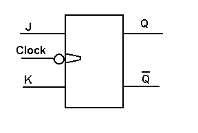

In electronics, a flip-flop or latch is a circuit that has two stable states and can be used to store state information. The circuit can be made to change state by signals applied to one or more control inputs and will have one or two outputs. Flip-flops and latches are a fundamental building block of digital electronics systems used in computers, communications, and many other types of systems. Flip-flops and latches are used as data storage elements. Such data storage can be used for storage of state, and such a circuit is described as sequential logic. When used in a finite-state machine, the output and next state depend not only on its current input, but also on its current state (and hence, previous inputs.) It can also be used for counting of pulses, and for synchronizing variably-timed input signals to some reference timing signal. Flip-flops can be either simple (transparent or opaque) or clocked (synchronous or edge-triggered); the simple ones are commonly called latches. The word latch is mainly used for storage elements, while clocked devices are described as flip-flops. 