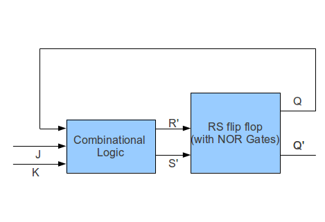

1. Design a master slave J-K flip flop as given in the Theory section. Use any of the clock cycles available. Give a sequence of J-K inputs for eg: 01, 10 , 00 , 00, 11 , 11, 01 etc and verify the output of the filp flop. Save this flip flop by marking appropriate inputs and outputs.

2. Import the J-K flip flop designed in 1st question. Connect the J-K to each other and label it as 'T'. The resulting flip flop is called a toggle flip flop. Generate a clock pulse or use any of the available ones. Verify that when T is 0, the output of flip flop does not change. When T=1, the output toggles at every negative edge of the clock. Save this circuit as a 'T' flip flop

3. Import the J-K flip flop designed in 1st question. Connect the compliment of J to K and label J as 'D'. The resulting flip flop is called a D flip flop. Generate a clock pulse or use any of the available ones. Verify that when D=1, output of flip flop is Q=1 and when D=0, output of flip flop is Q=0. Save this circuit as 'D' flip flop.

4. You are given a master slave RS flip flop made from NOR gates. Using this, design a circuit which behaves like a JK flip flop. The design can be like this : 

