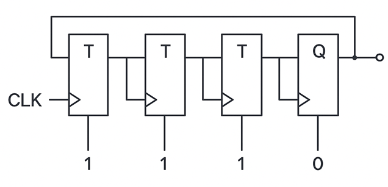

### SR Latch (Basic)

#### Circuit Diagram

_Figure 1: Basic SR Latch circuit diagram using two cross-coupled NOR gates. Reference: Theory section_

#### Components Required

- 2 NOR gates

#### Circuit Connections

1. Drag the first NOR gate and connect one of its inputs to the S (Set) input bit.
2. Drag the second NOR gate and connect one of its inputs to the R (Reset) input bit.
3. Connect the output of the first NOR gate to the second input of the second NOR gate. This output represents Q.
4. Connect the output of the second NOR gate to the second input of the first NOR gate. This output represents Q'.
5. Connect the Q output to the Q output bit and Q' output to the Q' output bit.
6. Set the values of S and R inputs (remember: S=1, R=1 is an invalid state).
7. Click on "Simulate" and observe the latch behavior for different input combinations.

#### Observations

- When S=0, R=0: The latch holds its previous state (memory function).
- When S=1, R=0: The latch sets (Q=1, Q'=0).
- When S=0, R=1: The latch resets (Q=0, Q'=1).
- When S=1, R=1: Invalid state (both outputs become 0, violating complementary relationship).
- If the circuit has been made as described above, a "Success" message will be displayed upon clicking "Submit".

### Gated SR Latch

#### Circuit Diagram

_Figure 2: Gated SR Latch circuit diagram using NAND gates with enable signal. Reference: Theory section_

#### Components Required

- 4 NAND gates

#### Circuit Connections

1. Drag the first NAND gate and connect its input points to the S and CLK input bits.
2. Drag the second NAND gate and connect its input points to the R and CLK input bits.
3. Drag the third NAND gate and connect one of its input points to the output of the first NAND gate.
4. Drag the fourth NAND gate and connect one of its input points to the output of the second NAND gate.
5. Connect the output of the third NAND gate to the Q output bit and to the second input of the fourth NAND gate.
6. Connect the output of the fourth NAND gate to the Q' output bit and to the second input of the third NAND gate.
7. Set the values of S and R inputs (avoid S=1, R=1 simultaneously).
8. Set CLK to control when the latch responds to inputs.
9. Click on "Simulate" and observe the gated latch behavior.

#### Observations

- When CLK=0: The latch ignores S and R inputs and maintains its current state.
- When CLK=1: The latch responds to S and R inputs following SR latch truth table.
- The enable signal (CLK) provides timing control over when changes can occur.
- If the circuit has been made as described above, a "Success" message will be displayed upon clicking "Submit".

### D Flip-Flop

#### Circuit Diagram

_Figure 3: D Flip-Flop circuit diagram showing data input with clock control for synchronous operation. Reference: Theory section_

#### Components Required

- 1 NOT gate
- 1 Gated SR Latch (or equivalent NAND gates)

#### Circuit Connections

1. Drag the NOT gate and connect its input to the D input bit.
2. Drag the Gated SR Latch component.
3. Connect the D input bit directly to the S input of the SR Latch.
4. Connect the output of the NOT gate to the R input of the SR Latch.
5. Connect the CLK input bit to the CLK input of the SR Latch.
6. Connect the Q and Q' outputs of the SR Latch to the Q and Q' output bits respectively.
7. Set the value of the D input bit as desired.
8. Toggle the CLK input to observe edge-triggered behavior.
9. Click on "Simulate" and observe the D flip-flop operation.

#### Observations

- When CLK transitions from 0 to 1 (positive edge): Q follows the D input value.
- When CLK=0 or CLK=1 (stable): Output remains unchanged regardless of D input changes.
- The D flip-flop eliminates the invalid state problem of SR flip-flops.
- Data is transferred from input to output only on clock edges (synchronous operation).
- If the circuit has been made as described above, a "Success" message will be displayed upon clicking "Submit".

### JK Flip-Flop (Master-Slave)

#### Circuit Diagram

_Figure 4: Master-Slave JK Flip-Flop circuit diagram showing master and slave latches for race-condition elimination. Reference: Theory section_

#### Components Required

- 2 3-input NAND gates
- 6 2-input NAND gates
- 1 NOT gate

#### Circuit Connections

**Master Stage:**

1. Drag the first 3-input NAND gate and connect its inputs to J, CLK, and Q' (feedback from slave).
2. Drag the second 3-input NAND gate and connect its inputs to K, CLK, and Q (feedback from slave).
3. Drag the first 2-input NAND gate and connect one input to the output of the first 3-input NAND gate.
4. Drag the second 2-input NAND gate and connect one input to the output of the second 3-input NAND gate.
5. Cross-couple the outputs: Connect output of first 2-input NAND to second input of second 2-input NAND, and vice versa.

**Clock Inverter:** 6. Drag the NOT gate and connect it to the CLK input bit to create inverted clock.

**Slave Stage:** 7. Drag the third 2-input NAND gate and connect its inputs to the output of the first master NAND gate and the inverted clock. 8. Drag the fourth 2-input NAND gate and connect its inputs to the output of the second master NAND gate and the inverted clock. 9. Drag the fifth 2-input NAND gate and connect one input to the output of the third NAND gate. Connect its output to the Q output bit. 10. Drag the sixth 2-input NAND gate and connect one input to the output of the fourth NAND gate. Connect its output to the Q' output bit. 11. Cross-couple the slave outputs: Connect Q output to second input of sixth NAND gate and Q' output to second input of fifth NAND gate.

**Feedback Connections:** 12. Connect the Q output to the third input of the second 3-input NAND gate (master). 13. Connect the Q' output to the third input of the first 3-input NAND gate (master). 14. Set values of J and K inputs as desired. 15. Toggle CLK and observe master-slave operation.

#### Observations

- During CLK=1 (positive): Master latch accepts J, K inputs; slave latch holds previous state.
- During CLK=0 (negative): Master latch holds state; slave latch updates output based on master state.
- When J=0, K=0: Hold current state (no change).
- When J=1, K=0: Set operation (Q becomes 1).
- When J=0, K=1: Reset operation (Q becomes 0).
- When J=1, K=1: Toggle operation (Q changes to complement).
- Race-around conditions are eliminated by master-slave configuration.
- If the circuit has been made as described above, a "Success" message will be displayed upon clicking "Submit".

### T Flip-Flop

#### Circuit Diagram

_Figure 5: T Flip-Flop circuit diagram implemented using JK Flip-Flop with J and K inputs tied together. Reference: Theory section_

#### Components Required

- 1 JK Flip-Flop

#### Circuit Connections

1. Drag the JK Flip-Flop component.
2. Connect both J and K input points of the JK Flip-Flop to the T input bit.
3. Connect the CLK input of the JK Flip-Flop to the CLK input bit.
4. Connect the Q and Q' outputs of the JK Flip-Flop to the Q and Q' output bits respectively.
5. Set the value of the T input bit as desired.
6. Toggle the CLK input to observe toggle behavior.
7. Click on "Simulate" and observe the T flip-flop operation.

#### Observations

- When T=0: The flip-flop holds its current state regardless of clock transitions.
- When T=1: The flip-flop toggles (changes to complement) on each positive clock edge.
- Toggle behavior makes T flip-flop ideal for frequency division (output frequency = input frequency ÷ 2).
- Useful in counter circuits and clock generation applications.
- The T flip-flop effectively converts the JK flip-flop's J=K=1 condition into a simple toggle input.
- If the circuit has been made as described above, a "Success" message will be displayed upon clicking "Submit".

### Advanced Exercise: 4-bit Binary Counter

#### Circuit Diagram

_Figure 6: 4-bit Binary Counter using T Flip-Flops connected in ripple configuration. Reference: Theory section_

#### Components Required

- 4 T Flip-Flops
- 1 Clock source

#### Circuit Connections

1. Connect the first T Flip-Flop with T input permanently set to 1 (always toggle).
2. Connect the CLK input to the first T Flip-Flop's clock input.
3. Connect the Q output of the first T Flip-Flop to the clock input of the second T Flip-Flop.
4. Connect the Q output of the second T Flip-Flop to the clock input of the third T Flip-Flop.
5. Connect the Q output of the third T Flip-Flop to the clock input of the fourth T Flip-Flop.
6. Set all T inputs of the flip-flops to 1.
7. Connect the Q outputs to represent the 4-bit binary count (Q₀, Q₁, Q₂, Q₃).
8. Apply clock pulses and observe the counting sequence.

#### Observations

- The counter counts from 0000 to 1111 (0 to 15 in decimal) and then resets to 0000.
- Each T flip-flop toggles when its clock input transitions from 1 to 0.
- The least significant bit (Q₀) toggles on every clock pulse.
- Higher-order bits toggle at progressively lower frequencies (frequency division).
- This demonstrates practical application of T flip-flops in digital counting systems.
- If the circuit has been made as described above, a "Success" message will be displayed upon clicking "Submit".
