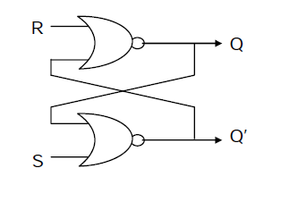
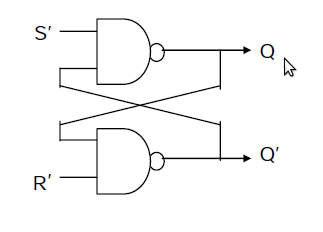
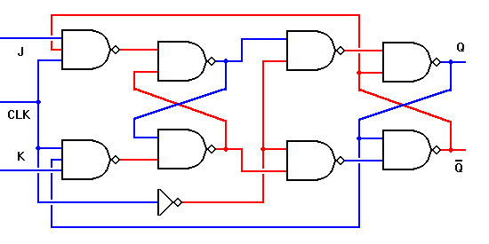
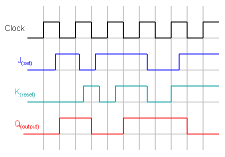
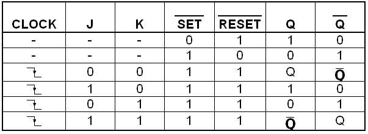

**NAND and NOR Latches**

**NOR Latch**

2-d vectors
It can be constructed from a pair of cross-coupled NOR logic gates. The stored bit is present on the output marked Q. While the S and R inputs are both low, feedback maintains the Q and Q outputs in a constant state, with Q the complement of Q. If S (Set) is pulsed high while R (Reset) is held low, then the Q output is forced high, and stays high when S returns to low; similarly, if R is pulsed high while S is held low, then the Q output is forced low, and stays low when R returns to low. 

**NAND Latch**

This is an alternate model of the simple SR latch built with NAND logic gates. Set and reset now become active low signals, denoted S and R respectively. Otherwise, operation is identical to that of the SR latch. Historically, SR-latches have been predominant despite the notational inconvenience of active-low inputs 

**JK Flip Flop** 

JK flip flop is mostly implemented as Master Slave flip flop. The information present at at J and K inputs is transmitted to master flip-flop on positive edge of a clock pulse and held there until negative pulse occurs, after which it is allowed to pass through the slave flip-flop. 

**JK Timing Digram** 

The following Digram depicts the change of JK flip flop Output with time pulse. It is negativve edge triggered. 

**Truth Table** 

 The following digram depicts the truth table of JK Flip Flop. 

