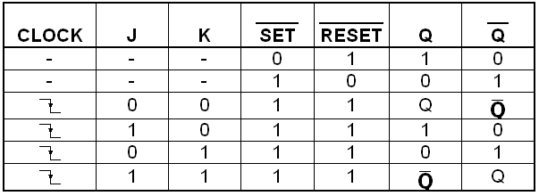

**NAND and NOR Latches**

**NOR Latch**

It can be constructed from a pair of cross-coupled NOR logic gates. The stored bit is present on the output marked Q. While the S and R inputs are both low, feedback maintains the Q and Q' outputs in a constant state, with Q' being the complement of Q. If S (Set) is pulsed high while R (Reset) is held low, then the Q output is forced high, and stays high when S returns to low; similarly, if R is pulsed high while S is held low, then the Q output is forced low, and stays low when R returns to low. 

**NAND Latch**

This is an alternate model of the simple SR latch built with NAND logic gates. Set and reset now become active low signals, denoted S and R respectively. Otherwise, operation is identical to that of the SR latch. Historically, SR-latches have been predominant despite the notational inconvenience of active-low inputs 

**JK Flip Flop** 

JK flip flop is mostly implemented as Master Slave flip flop. The information present at J and K inputs is transmitted to master flip-flop on positive edge of a clock pulse and held there until negative pulse occurs, after which it is allowed to pass through the slave flip-flop. 

**JK Timing Digram** 

The following Diagram depicts the change of JK flip flop Output with time pulse. It is negative edge triggered. 

**Truth Table** 

 The following diagram depicts the truth table of JK Flip Flop. 

**RS Flip Flop**

The RS flip-flop is used to store binary information (i.e. 0 or 1). It consists of two inputs, SET and RESET. In RS flip-flop ‘R’ Stands for RESET and ‘S’ stands for SET. The flip-flop keeps its present state even when one or both inputs are deactivated. The flip-flop enters the ‘0’ state when the RESET input is activated, and the ‘1’ state when the SET input is activated.

**D FLip Flop**

D flip flop is an electronic devices that is known as “delay flip flop” or “data flip flop” which is used to store single bit of data.D flip flops are synchronous or asynchronous. The clock single required for the synchronous version of D flip flops but not for the asynchronous one.The D flip flop has two inputs, data  and clock input which controls the flip flop. when clock input is high, the data is transferred to the output of the flip flop and when the clock input is low, the output of the flip flop is held in its previous state.

**T FLip Flop**

T flip flop or to be precise is known as Toggle Flip Flop because it can able to toggle its output depending upon on the input.
T here stands for Toggle.
Toggle basically indicates that the bit will be flipped i.e., either from 1 to 0 or from 0 to 1.
Here, a clock pulse is supplied to operate this flop, hence it is a clocked flip-flop.

