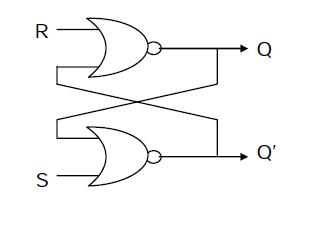
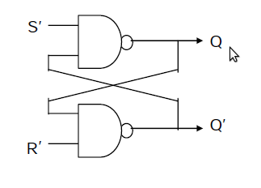
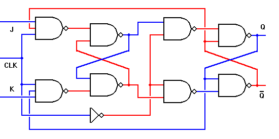
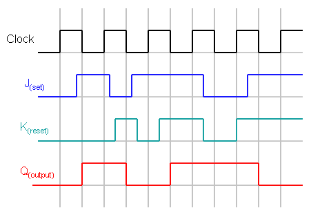

### SR Latch (NOR-based)

An SR latch is a basic memory element that can store one bit of information. It can be constructed from a pair of cross-coupled NOR logic gates. The stored bit is present on the output marked Q, while Q' represents the complement of Q. This latch has two control inputs: S (Set) and R (Reset).

#### Operation Principle

- **Hold State**: When both S and R inputs are low (0), the latch maintains its current state through cross-coupled feedback
- **Set State**: When S is high (1) and R is low (0), the output Q is forced to high (1)
- **Reset State**: When R is high (1) and S is low (0), the output Q is forced to low (0)
- **Invalid State**: When both S and R are high (1), both outputs become low, violating the complementary relationship

#### Logic Equations

**Q = S + (R)' · Q**

**Q' = R + (S)' · Q'**

#### Truth Table

| S | R | Q | Q' | State |
|---|---|---|----|----|
| 0 | 0 | Q | Q' | Hold (No Change) |
| 1 | 0 | 1 | 0 | Set |
| 0 | 1 | 0 | 1 | Reset |
| 1 | 1 | 0 | 0 | Invalid |

#### Key Features

- Basic bistable memory element
- Asynchronous operation (no clock required)
- Two stable states for storing binary information
- Forms the foundation for more complex memory circuits
- Invalid state occurs when both inputs are active

#### Applications

- Basic memory storage in digital circuits
- Foundation for building flip-flops
- Control circuits and state machines
- Temporary data storage in processors

### SR Latch (NAND-based)

This is an alternate implementation of the SR latch built with NAND logic gates. Set and reset now become active low signals, denoted S' and R' respectively. The operation is identical to the NOR-based SR latch, but with inverted control signals.

#### Operation Principle

- **Hold State**: When both S' and R' inputs are high (1), the latch maintains its current state
- **Set State**: When S' is low (0) and R' is high (1), the output Q is forced to high (1)
- **Reset State**: When R' is low (0) and S' is high (1), the output Q is forced to low (0)
- **Invalid State**: When both S' and R' are low (0), both outputs become high, creating an invalid condition

#### Truth Table

| S' | R' | Q | Q' | State |
|----|----|----|----|----|
| 1 | 1 | Q | Q' | Hold (No Change) |
| 0 | 1 | 1 | 0 | Set |
| 1 | 0 | 0 | 1 | Reset |
| 0 | 0 | 1 | 1 | Invalid |

#### Key Features

- Active low control signals
- Equivalent functionality to NOR-based SR latch
- Historically more prevalent in digital systems
- NAND gates are often easier to implement in integrated circuits

### JK Flip-Flop

The JK flip-flop is an improved version of the SR flip-flop that eliminates the invalid state problem. It has two data inputs J and K, along with a clock input for synchronous operation. The JK flip-flop can perform all four basic operations: hold, set, reset, and toggle.

#### Operation Principle

- **Hold**: When J = 0 and K = 0, the output remains unchanged
- **Set**: When J = 1 and K = 0, the output Q becomes 1
- **Reset**: When J = 0 and K = 1, the output Q becomes 0
- **Toggle**: When J = 1 and K = 1, the output toggles to its complement

#### Truth Table

| J | K | CLK | Q(n+1) | Operation |
|---|---|-----|--------|-----------|
| 0 | 0 | ↑ | Q(n) | Hold |
| 1 | 0 | ↑ | 1 | Set |
| 0 | 1 | ↑ | 0 | Reset |
| 1 | 1 | ↑ | Q'(n) | Toggle |

#### Characteristic Equation

**Q(n+1) = J · Q'(n) + K' · Q(n)**

#### Key Features

- Eliminates the invalid state of SR flip-flop
- Edge-triggered operation for synchronous circuits
- Toggle capability makes it versatile for counters
- Can implement any other type of flip-flop
- Most versatile flip-flop design

#### Applications

- Binary counters and frequency dividers
- State machines and sequential logic
- Memory registers in processors
- Control circuits in digital systems

### Master-Slave JK Flip-Flop

The Master-Slave JK flip-flop consists of two SR latches connected in series to prevent race-around conditions. The master latch is enabled during the positive half of the clock cycle, while the slave latch is enabled during the negative half.

#### Operation Principle

**Positive Clock Edge**: 
- Master latch accepts J and K inputs
- Slave latch is disabled, maintaining previous output
- Internal signals S_bar and R_bar are generated within the master section

**Negative Clock Edge**:
- Master latch is disabled, holding its state
- Slave latch transfers the master's state to the output

#### Internal Signal Relationships

In the master-slave configuration shown:
- **S_bar**: Internal set signal from master to slave (active low)
- **R_bar**: Internal reset signal from master to slave (active low)
- **Relationship**: S_bar = NOT(J AND CLK AND Q'), R_bar = NOT(K AND CLK AND Q)

#### JK Timing Diagram

The timing diagram shows how the JK flip-flop output changes with respect to the clock and input signals. Key observations:

- Output changes occur on the falling edge of the clock (negative edge triggered)
- J and K inputs are sampled during the positive clock period
- Output is stable during the positive clock period
- Race-around condition is eliminated by the master-slave configuration

#### Key Features

- Eliminates race-around problems in JK flip-flops
- Edge-triggered operation with well-defined timing
- Internal isolation between input sampling and output changes
- Robust operation in high-speed digital systems

### D Flip-Flop

A D flip-flop, also known as a "data flip-flop" or "delay flip-flop," is used to store a single bit of data. It has only one data input (D) along with a clock input, making it simpler than the JK flip-flop while eliminating timing issues.

#### Operation Principle

The D flip-flop transfers the data input to the output on each clock edge. The operation is straightforward:
- When the clock triggers, Q becomes equal to D
- The output remains stable until the next clock edge
- There are no invalid states or race conditions

#### Truth Table

| D | CLK | Q(n+1) | Operation |
|---|-----|--------|-----------|
| 0 | ↑ | 0 | Store 0 |
| 1 | ↑ | 1 | Store 1 |
| X | No Edge | Q(n) | Hold |

#### Characteristic Equation

**Q(n+1) = D**

#### Key Features

- Single data input eliminates invalid states
- Simple and reliable operation
- Edge-triggered for synchronous systems
- Excellent for data storage and transfer
- No race conditions or timing issues

#### Applications

- Data registers and memory units
- Shift registers for serial data processing
- Pipeline stages in processors
- Synchronization of asynchronous signals
- Temporary storage in digital systems

### T Flip-Flop

A T flip-flop, or Toggle flip-flop, changes its output state on each clock pulse when the T input is high. It is particularly useful for frequency division and counter applications.

#### Operation Principle

- **Hold**: When T = 0, the output remains unchanged regardless of clock edges
- **Toggle**: When T = 1, the output toggles (changes to its complement) on each clock edge

#### Truth Table

| T | CLK | Q(n+1) | Operation |
|---|-----|--------|-----------|
| 0 | ↑ | Q(n) | Hold |
| 1 | ↑ | Q'(n) | Toggle |

#### Characteristic Equation

**Q(n+1) = T ⊕ Q(n)**

#### Key Features

- Simplest flip-flop for toggle operations
- Divides input frequency by 2 when T = 1
- Can be constructed from JK flip-flop (J = K = T)
- Edge-triggered operation
- Essential building block for counters

#### Applications

- Binary counters and frequency dividers
- Clock generation circuits
- Ripple counters in digital systems
- Pulse shaping and timing circuits
- State toggles in control systems

#### Conversion from JK Flip-Flop

A T flip-flop can be easily implemented using a JK flip-flop by connecting both J and K inputs together to form the T input:

**T = J = K**

This configuration ensures that when T = 1, both J = K = 1, causing the toggle operation.